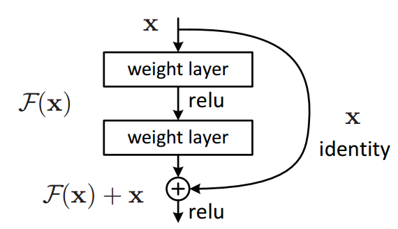

# Using Tensorflow
The idea here was to build a really simple image classifier for the MNIST 
data set and to put together a small application that would serve the
resulting model.

The BASH script `install.sh` should be run from the root directory of the project and Docker
must be installed (script will exit if it's not). Also, an internet connection
must be available in order to download Docker images from *Docker Hub*.

See below for a more detailed description of the project.

## Model
A small ResNet model was used, as it was the focus of an example that I liked and performed 
fairly well. It used 3 building blocks of residual learners, where a block
is built up as shown below



in addition to a final batch normalization, an average pooling, and a Dense
(fully connected) layer with 10 outputs, corresponding to the 10 digits in the
image set.

Each weight layer contains more batch normalization and ReLU operations, in addition
to convolution layers.

## Docker
I decided to use docker images for both training the model and serving. 

### Framework
I tried to use docker for everything here, as it supports portability and consistency
without sacrificing too much in performance, like virtual machines that emulate CPUs
and use those emulators to run their own OS kernel.  Also,
* we desire for a repeatable and consistent environments for data science 
and research and deployment,
* and as things scale, the models and data sets for research can grow and the 
volume of requests to the API service can increase.  Kubernetes, or a similar tool can be used
 to manage fleet of docker containers, to affect auto-scaling and fault-tolerance,
 not just to random, unexpected failures, but for planned swaps and A/B testing.

### Setup
I used mostly off-the-shelf docker images and did not do some more advanced things
like extend docker images by copying assets to the image(s).

### Images

#### **`tensorflow/tensorflow:2.1.0-py3-gpu-jupyter`** 
This was used to train a model and save it as a `TFSavedModel`. The only 
slightly tricky configuration is to 
ensure that the docker image can access CUDA to enable use of the GPU. It is required
to install `nvidia-container-toolkit` on the host and to use the `--gpus=all` flag:
```
docker run --gpus all --rm -it -p 8888:8888 tensorflow/tensorflow:2.1.0-gpu-py3-jupyter
```

To run a file:
```
docker run --name arturo_train --gpus all --rm -it -p 8888:8888 --mount type=bind,source=/home/mike/Repos/CaseStudies/Arturo,target=/arturo tensorflow/tensorflow:2.1.0-gpu-py3-jupyter
docker exec -ti arturo_train py /arturo/test.py
```

While this is a small training data set, in a real application, that may 
not be the case and we want to use hardware accelerators to expedite training.

Also, note that this image was **big**, at 4.26GB.  Since we get a lot in terms of
partability and function, we can live with this larger footprint, particularly
since it's being used to train and validate, which is an activity that is assumed
will not be occuring "online", meaning dynamically, as more data becomes available.

If there is a requirement to train online, we can still use a container with
this docker image running, but would require a middleware fleet of containers
directing traffic for training, potentially distributing the load amongst
mutliple GPU units, should throughput become high enough.


#### **`tensorflow/serving`**
This image is much more lightweight, relatively speaking, than **`tensorflow/tensorflow:2.1.0-py3-gpu-jupyter`**,
at 251MB.  Still not the thin server, we would hope for, but given how much this image
can do in one container, it's probably a good tradeoff.  Note that `$MODEL_PATH` 
**must** be absolute
```
docker run --name arturo_backend --rm -p 8501:8501 -p 8500:8500  \
--mount type=bind,source=$MODEL_PATH/my_mnist_model,target=/models/my_mnist_model \
-e MODEL_NAME=my_mnist_model -t tensorflow/serving
```

#### **`virtualenv` for client application**
The client application is run from a virtualenv (Python 3.6) using the `requirements.txt` file.

## Server
I used TFServing as a backend, as it was very easy to set up and run using a fairly lightweight
docker image and works well in multiple cloud environments (AWS and GCP).   

I built a small RESTful API in Flask to act as a front end to TFServing. While
I haven't implemented these things, we would want to use Flask to
* enforce compression of payload and 
* implement other outward-facing security, like SSL/TLS (i.e. https) certification, API keys, etc.

## Client
This is a simple client and while it may seem easiest and most straightforward
to just use the RESTful API to submit requests, TFServing also allows for gRPC
requests, which are based on Google's Protobuf and are more efficient than sending 
a lot of plaintext JSON data (i.e. images) over a network.
 
Both types of requests are demonstrated in `client.py` 

Note that this client runs on a virtualenv, specified by the `requirements.txt` file
and the use of Python 3.6.


